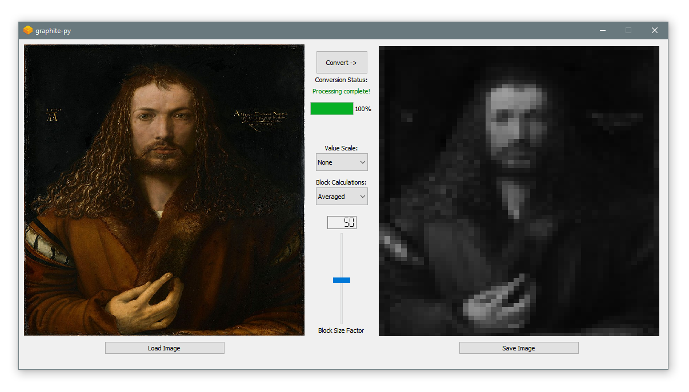
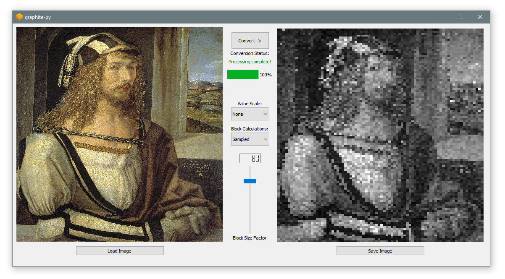
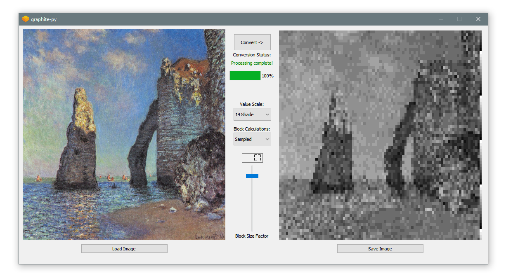

# graphite-py
A graphical interface to apply grayscale pixel transformations to images, written in Python.

## Showcase

Screenshots of the tool in action (subject to change/replacement as the UI and functionality are updated)







## Setup

##### Production

Check out the [Releases Page](https://github.com/d-mckee/graphite-py/releases) for current downloads. 

##### Development

<u>Requirements:</u> Python 3.x.x (preferably 3.6), pip

*Note:* fbs cannot build projects for release with Python versions past 3.6, so stick to 3.6 when creating the venv if this is something you need.

First, clone the GitHub repo to your directory of choice

```
git clone https://github.com/d-mckee/graphite-py
```

Then, create the virtual environment (venv) to locally install the required libraries

```
python -m venv venv
```

Then, install the frozen requirements from the requirements.txt file

```
# Windows
venv\Scripts\activate.bat
pip install -r requirements.txt
deactivate

# MacOS/Linux
source venv/bin/activate
pip install -r requirements.txt
deactivate
```

To run the project, either use the included batch/shell script files, or enable the venv and use `fbs run` to start it up. 